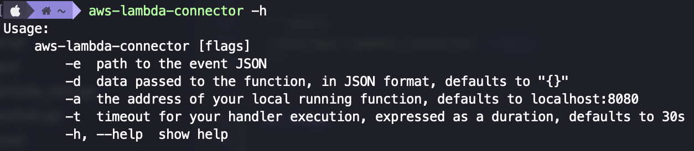

# aws-lambda-connector

 


The idea was born with the intention of not using AWS sam or docker to be able to execute a lambda made in Golang locally and invoke it, which allows a more agile and efficient development.

## Architecture


## Installation

### Using go

You need to install the connector in your home

```shell
go install github.com/erbalo/aws-lambda-connector@latest
```

**Note:** To use the connector in your system, maybe you should add the environment variable where the GOPATH is located.

Example of how to update the path using Unix

```shell
export PATH=$PATH:$(go env GOPATH)/bin
```

### Cloning the repo

You can clone the repo and build the project.

Step 1. Clone the repo

```shell
git clone https://github.com/erbalo/aws-lambda-connector.git
```

Step 2. Move on the folder

```shell
cd aws-lambda-connector
```

Step 3. Create the binary

```shell
make all
```

The last command will create a `bin` folder; you can detect the binary to execute according to your OS.

Then you can execute the binary according to your OS.

Linux/MacOS example:

```shell
./bin/aws-lambda-connector --help
```

## Usage

To use the connector you can execute the following commands:


