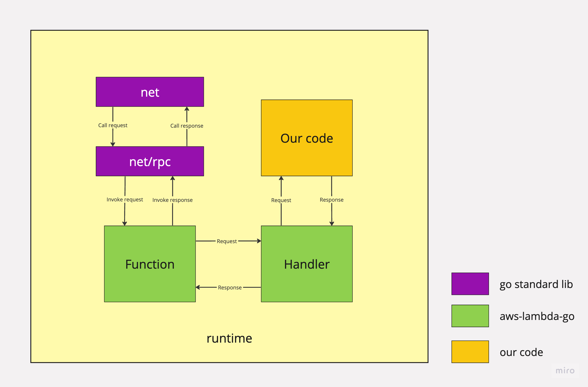

# aws-lambda-connector
---

The idea was born with the intention of not using AWS sam or docker to be able to execute a lambda made in Golang locally and invoke it, which allows a more agile and efficient development.

## Architecture

## Installation

### Using go

You need to install in you home

### Cloning the repo
